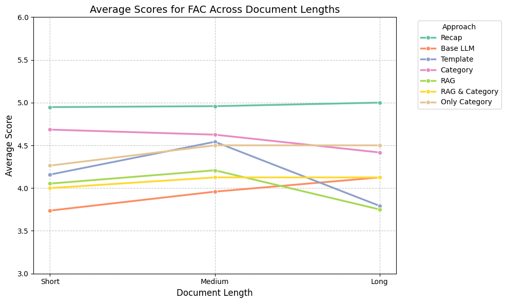

# MM_Agenda_Generation_Research

- [Problem statement](#problem-statement)
- [Data](#data)
- [Relative Work](#relative-work)
- [Structure](#structure)
- [Citation](#citation)
## Problem statement 

To have an effective meeting, one of importance things that people need to do is creating the agenda. Can LLM help us generate  good agenda and how we can evaluate them?

## Data

In this research we use [the AMI Meeting Corpus](https://groups.inf.ed.ac.uk/ami/corpus/) for create custom dataset to create a benchmark. 
You can read the paper [here](http://researchgate.net/publication/228341280_The_AMI_meeting_corpus)

## Relative Work

How to evaluate Agenda: [slide](https://docs.google.com/presentation/d/1iiOo7pPinrH_N_7TY9XMVnz8J738FDCFo5OtqsyMvfQ/edit#slide=id.g33fa84a1bc7_0_25)

Methods: [slide](https://docs.google.com/presentation/d/1S0Y8N7vJnB_Wn6DxQaQODqYQs5uwDTh11XYH8t6XU1g/edit#slide=id.g33dbe6822f7_0_0)

Planning: [excel](https://docs.google.com/spreadsheets/d/1hhdFToHsAZZutpfm2WXAjE-FVN8yn5oOTA44gVGkgoA/edit?gid=593644040#gid=593644040)

## Structure


## Implementation
1. Clone git code:
```Bash
cd mm_agenda_generation_research
conda activate mm_agenda_generation_research
pip install -r requirements.txt
```

## Evaluation

After generate the agenda of each experiment, you can run the evaluation by using GPT4o-mini or Gemini Flash 2.0 to get FACTSCORE of the agenda against the transcript and between the agenda with the shared docs.

1. Go to **sma_evaluation** folder.

    ```Bash
    cd sma_evaluation/
    ```
2. Create the config file.

    a. GPT:

    Create the **gpt_config.json**
    ```json

    {
        "api_key": "YOUR_KEY",
        "model_name": "gpt-4o-mini"
    }
    ```

    b. Gemini:
    
    Create the **gemini_config.json**
    ```json

    {
        "api_key": "YOUR_KEY",
        "model_name": "gemini-2.0-flash"
    }
    ```

3. Run the evaluation.
    
    a. GPT:
    ```bash
    python main_gpt.py \
    --source-dir dataset/generate_only_category_truncated_multi_input_agenda \
    --output-csv only_cat_output.csv
    ```
    Arguments: 
    
    --source-dir Output folder from your experiment that contain json files of agenda.
               
    --output-csv Filename that you will store the FACTSCORE.
    
    --doctype Document type to evaluate with agendas (must be "transcript" or "shared_docs").


    b. Gemini:
    ```bash
    python main_gemini.py \
    --source-dir dataset/generate_category_rag_multi_input_agenda \
    --output-csv cat_rag_multi_ouput.csv \
    --gemini-config gemini_config.json \
    --doctype shared_docs
    ```
    Arguments: 
    
    --source-dir Output folder from your experiment that contain json files of agenda.
               
    --output-csv Filename that you will store the FACTSCORE.

    --gemini-config Name of the gemini configuration file.

    --doctype Document type to evaluate with agendas (must be "transcript" or "shared_docs").

4. Analysis the evaluation.

    In **sma_evaluation** go to **EDA** folder.
    ```bash
    cd EDA
    ```
    a. GPT:
    
    To visualize the result of the evaluation, open the notebook **eda_evaluation_result gpt_transcript.ipynb** and **eda_evaluation_result gpt_shared_docs.ipynb** and run all cells to get the line charts for GPT evaluation.
    
    **Example:**

    

    To get the Average/F1 score table of each scores (FAC, INF, REL, OVR, FAC_DOC, INF_DOC, REL_DOC, OVR_DOC), you only need to run the **eda_evaluation_result gpt_shared_docs.ipynb**

    **Example:**

    [Average Score Example](sma_evaluation/EDA/example_outputs/avg_out.csv)   

    [F1 Score Example](sma_evaluation/EDA/example_outputs/f1_out.csv)   


## Citation

